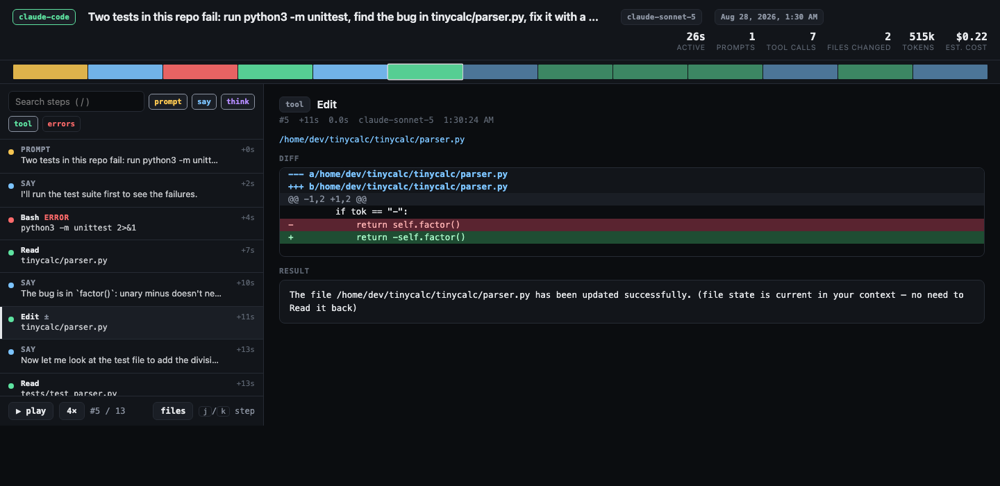

<p align="center">
  
</p>

<h1 align="center">agentcast</h1>
<p align="center"><b>asciinema for AI coding agents.</b><br>
Turn any Claude Code or Codex session already on your disk into a shareable, scrubbable replay — every prompt, every file read, every edit as a diff, every command, tokens, cost, blast radius.</p>

<p align="center">
  <a href="https://greenaisolution.github.io/agentcast/">▶ Live demo</a> ·
  <a href="#install">Install</a> ·
  <a href="#why">Why</a> ·
  <a href="#privacy">Privacy</a> ·
  <a href="#how-it-works">How it works</a>
</p>

<p align="center">
  
  
  
  
</p>

---

```bash
pip install agentcast      # or: uvx agentcast ui
agentcast ui               # every session you've ever run, in your browser
```

That's it. No account, no upload, no config. Claude Code and Codex already write a full log of every session to your home directory. `agentcast` reads those logs and turns them into something you can actually look at — and hand to someone else.

## What you get

| | |
|---|---|
| **Replay** | Step through a session like a video: play/pause, 1×–64×, keyboard `j`/`k`, click anywhere on the timeline strip. |
| **Every edit as a diff** | `Edit`, `Write`, `MultiEdit`, Codex `apply_patch` — rendered as unified diffs, not JSON blobs. |
| **Blast radius** | One panel listing every file the agent read, edited, created or deleted, with counts. Click a file to see only the steps that touched it. |
| **Errors surfaced** | Failed commands and tool errors are red on the timeline. Filter to *just* the errors. |
| **Tokens & cost** | Real usage from the log, cost estimated at list price per model. |
| **Deep links** | `replay.html#142` opens at step 142. Put it in a PR review comment. |
| **One file** | Each replay is a single self-contained `.html`. Email it, attach it to a ticket, drop it in Slack, host it on Pages. |
| **Stats across everything** | `agentcast stats` — hours, tokens, dollars, most-used tools, most-edited files, hour-of-day histogram. |

## Install

```bash
pip install agentcast
# or run without installing:
uvx agentcast ui
pipx run agentcast ui
# or straight from the repo (pure stdlib, nothing to build):
git clone https://github.com/GreenAiSolution/agentcast && cd agentcast && python3 -m agentcast ui
```

Requires Python 3.9+. **Zero dependencies** — standard library only. Works on macOS, Linux and Windows.

## Commands

```
agentcast ui                       browse every session on this machine (127.0.0.1 only)
agentcast list                     table: agent, started, active time, prompts, tool calls, files changed, tokens, cost
agentcast render <id|path> -o x.html   write one self-contained replay
agentcast open <id|path>           render to a temp file and open it
agentcast json <id|path>           the normalised session as JSON (build your own tooling on it)
agentcast stats                    totals across all sessions
```

`<id>` can be a full session id, a prefix (`agentcast open 8057`), or a path to a `.jsonl` log.

Sessions are discovered in `~/.claude/projects/**` and `~/.codex/sessions/**`. Add more roots with `AGENTCAST_ROOTS=/path/a:/path/b`.

## Why

An AI agent just made 300 tool calls and changed 14 files in your repo. The diff tells you *what* changed. It does not tell you what the agent read before deciding, which commands failed on the way, where it went in circles, or what the prompt actually said.

The full record exists — Claude Code and Codex log everything — but as multi-megabyte JSONL nobody opens. `agentcast` is the missing viewer.

Use it to:

- **Review agent PRs properly.** Link the replay in the PR: *"see step 88, that's where it decided to rewrite the migration."*
- **Onboard teammates to agentic coding.** Show them a real session instead of a blog post.
- **Debug a bad run.** Filter to errors, find the command that failed, see what the agent did next.
- **Find out what it costs.** `agentcast stats` on a month of sessions is a number your manager will want.
- **Share what you built.** A replay of the session that built a feature is a better demo than the feature.

## Privacy

Everything runs locally. `agentcast ui` binds to `127.0.0.1` and never makes a network request. No telemetry.

Rendered replays are **redacted by default**: API keys (Anthropic, OpenAI, GitHub, AWS, Slack, Stripe, Google, Vercel), JWTs, private keys, `Bearer` tokens, `SECRET=`/`TOKEN=`/`PASSWORD=` assignments and `https://user:pass@` URLs are replaced with `[REDACTED:kind]`, and your home directory becomes `~`. Pass `--no-redact` / `--keep-paths` to turn that off.

Redaction is pattern-based and cannot know what *you* consider sensitive. **Read a replay before you post it publicly.** Tool outputs include whatever the agent saw — file contents, command output, web pages.

## How it works

```
~/.claude/projects/<proj>/<session>.jsonl  ──┐
                                              ├─▶ parsers/ ─▶ Session ─▶ render.py ─▶ one .html
~/.codex/sessions/YYYY/MM/DD/rollout-*.jsonl ─┘        (normalised model: steps, files, diffs, usage)
```

- `parsers/claude_code.py` walks the Claude Code log: user prompts, assistant text/thinking, `tool_use` blocks matched to their `tool_result` by id (which also gives per-call duration), usage de-duplicated by message id, sub-agent steps flagged.
- `parsers/codex.py` does the same for Codex rollouts: `function_call`/`custom_tool_call` matched by `call_id`, `apply_patch` bodies converted to unified diffs, token totals from `token_count` events.
- `render.py` embeds the normalised JSON in a small vanilla-JS viewer. No frameworks, no CDN, no fonts to fetch — a replay opens from `file://` with the network unplugged.

The normalised model is deliberately small (`agentcast/model.py`, ~60 lines). If you want to build a dashboard, a CI check, or a "did the agent touch `prod/`?" guard, `agentcast json` gives you the data.

## Supported agents

| Agent | Status |
|---|---|
| Claude Code | ✅ prompts, text, thinking, every built-in tool, MCP tools, sub-agents, usage |
| OpenAI Codex CLI / VS Code | ✅ prompts, messages, reasoning summaries, `exec_command`, `apply_patch`, usage |
| Gemini CLI, Cursor, Aider, OpenCode … | 🙏 wanted — a parser is one file that yields `Step`s; see `agentcast/parsers/codex.py` (150 lines) |

## Development

```bash
python3 -m unittest discover -s tests -v      # 26 tests, <1s, no deps
```

Fixtures in `tests/fixtures/` are hand-written minimal logs for both formats; the tests cover parsing, diffs, redaction, cost, the CLI and the HTML output (including the `</script>` escape).

## License

MIT © Jaden Green
